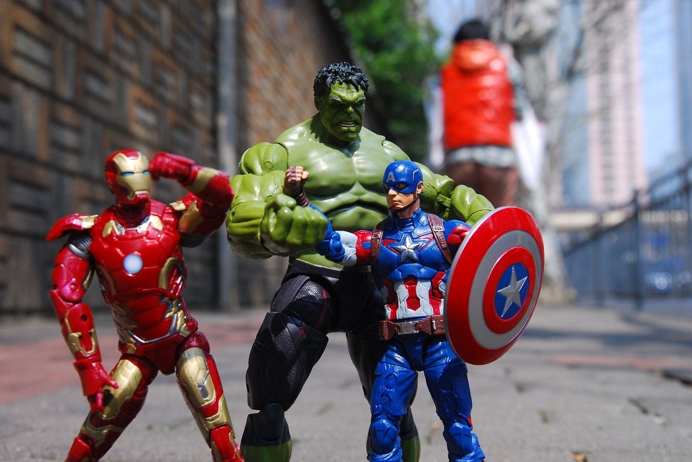
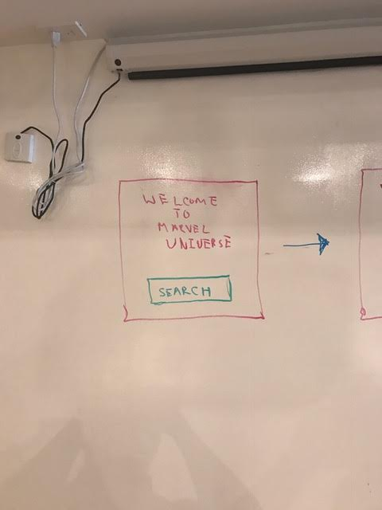
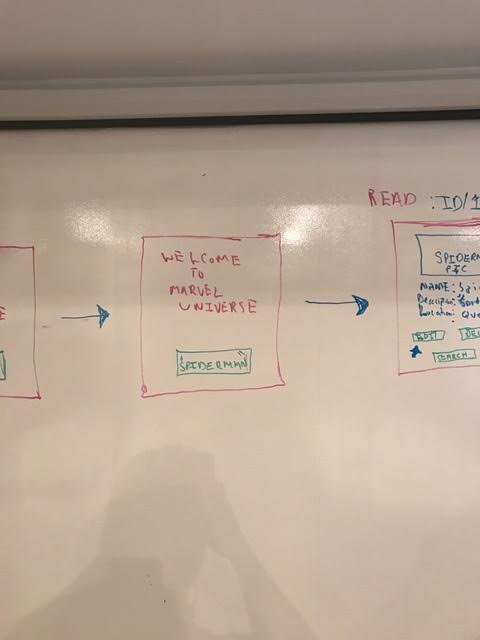
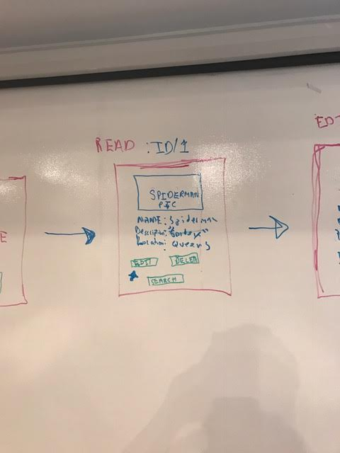
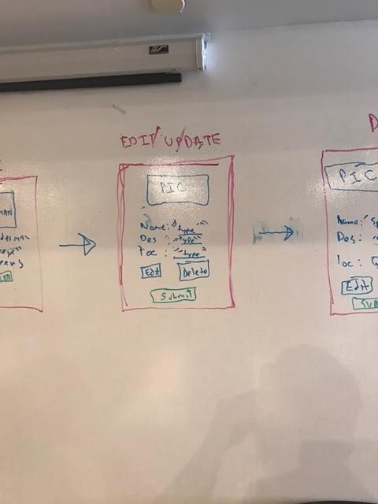
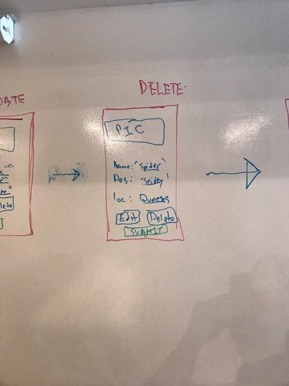
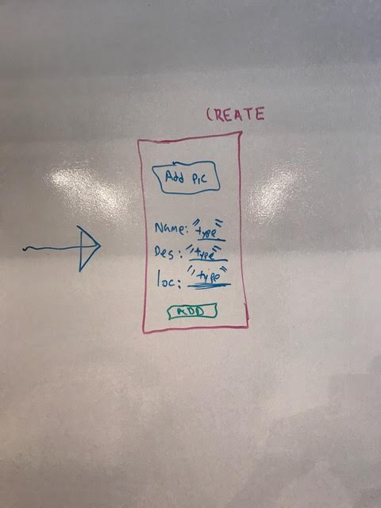

# PROJECT 2: SUPERHERO APPLICATION

Growing up I was always mesmerized by the superheroes and their ability to be provided with supernatural powers.  The acts of altruism speaks to the human spirit and our intate drive to seek goodness.  The reminscing back to the  nostalgia running through comicbook stores as a child inspired me to tap into the Marvel Universe to create an application that list all the superheroes that became staples of my childhood.  

### TECHNOLOGIES USED

After a rigourous and thought provoking guide to building a collective CRUD based "quotes app"; I aim to use an express server to create a database with a collection of superheroes.  The application will combine the use of SQL through POSTGRESS and 'fetch' some data from the open-source Marvel API.  The project will incorporate both the element of client side and server-side.  I will be using Effective Javascript (.ejs) and partials to create rich content to appear on your local computer screen.

Below is the link for the Marvel API (in case you were curious):

https://developer.marvel.com/

### USER EXPRIENCE 

I want to create an application that has the ability for the USER to view some of my favorite superheroes.  The USER should be able to create a new superhero or edit the existing superhero. There will be a login if I reach post MVP that allows USERS to save their favorite users.  THe application will have all the Create Read Update Delete (CRUD) features.  

### CHALLENGES

The SQL query will probably be able to hard to approach; to try to create call a query. I think the login will be diffcult to reach and the search for the superhero. I think I will learn the most from the errors I will encounter.

### WIREFRAMES

